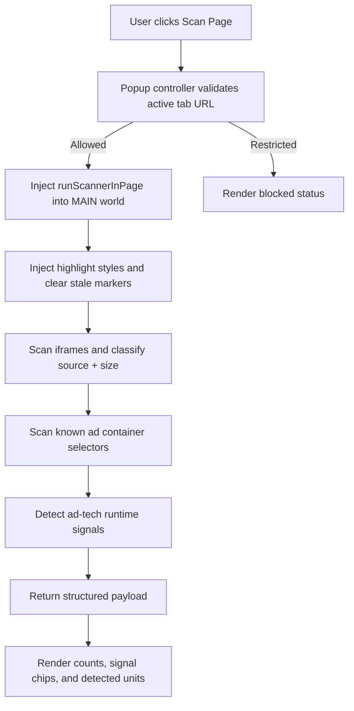

<div align="center">

<pre>
           _        _                           _                       _            _              _     
          | |      (_)                         | |                     | |          | |            | |    
  __ _  __| |______ _ _ __  ___ _ __   ___  ___| |_ ___  _ __ ______ __| | _____   _| |_ ___   ___ | |___ 
 / _` |/ _` |______| | '_ \/ __| '_ \ / _ \/ __| __/ _ \| '__|______/ _` |/ _ \ \ / / __/ _ \ / _ \| / __|
| (_| | (_| |      | | | | \__ \ |_) |  __/ (__| || (_) | |        | (_| |  __/\ V /| || (_) | (_) | \__ \
 \__,_|\__,_|      |_|_| |_|___/ .__/ \___|\___|\__\___/|_|         \__,_|\___| \_/  \__\___/ \___/|_|___/
                               | |                                                                        
                               |_|                                                                        
</pre>

</div>

A developer-first ad diagnostics and logging extension for inspecting live ad slots, SSP integrations, and runtime ad-tech signals directly in the browser.

[](manifest.json)
[](manifest.json)
[](package.json)
[](LICENSE)

<a href="https://github.com/OstinUA/ad-inspector-devtools" target="_blank" rel="noopener"></a>


## Table of Contents

- [Features](#features)
- [Tech Stack \\& Architecture](#tech-stack--architecture)
- [Getting Started](#getting-started)
- [Testing](#testing)
- [Deployment](#deployment)
- [Usage](#usage)
- [Configuration](#configuration)
- [License](#license)
- [Contacts \\& Community Support](#contacts--community-support)

## Features

- Real-time, in-page ad inventory scanning across `iframe` and ad container elements.
- Source classification against curated ad-server and SSP domain signatures:
  - Google stack (`doubleclick`, `googlesyndication`, `googletagservices`, etc.)
  - Header bidding ecosystems (Prebid-linked exchanges and adapters)
  - Amazon APS
  - Facebook, Taboola, and Outbrain signals
- IAB standard size recognition (16 common ad dimensions), including fallback dimension extraction from bounding rectangles.
- Automatic ad container discovery using ad-focused CSS selectors (`div-gpt-ad`, `adsbygoogle`, `data-ad-slot`, and similar patterns).
- Runtime ad-tech signal detection from page globals:
  - GPT and version
  - Prebid.js and version
  - Amazon APS
  - AdSense
  - Google Analytics / `gtag` / `dataLayer`
- Visual instrumentation overlays with category-aware highlighting and top-left labels.
- Popup dashboard with:
  - category counters
  - detected technology chips
  - truncated detected-unit list for quick triage
- Safe execution model that blocks scanner actions on restricted URLs (Chrome internal pages, extension pages, Web Store, `file://`, etc.).
- One-click cleanup workflow to remove all injected markers and style tags.
- Modular ES module codebase with clear separation between scanning logic and popup rendering logic.

> [!IMPORTANT]
> AdOps X-Ray executes scans in the active tab’s main world using `chrome.scripting.executeScript`, and only when URLs pass explicit allowability checks.

## Tech Stack & Architecture

### Core Technologies

- **Language:** JavaScript (ES Modules)
- **Runtime Target:** Chrome Extension, Manifest V3
- **UI Layer:** Popup HTML/CSS/JS
- **Static Analysis:** ESLint (`^8.57.0`)
- **Packaging:** Native `zip`-based artifact creation (`adops-xray.zip`)

### Project Structure

```text
ad-inspector-devtools/
├── core/
│   ├── constants.js        # Signatures, selectors, styles, categories
│   ├── detector.js         # Pure detection/classification helpers
│   └── scanner.js          # In-page scan + clear executables
├── ui/
│   └── popup/
│       ├── popup.html      # Extension popup markup
│       ├── popup.css       # Popup styling and state visuals
│       ├── popup.js        # Popup controller and script injection flow
│       └── renderer.js     # Result rendering, chips, and list formatting
├── icons/
│   └── icon128.png
├── manifest.json           # MV3 metadata and permissions
├── package.json            # Scripts and dev dependencies
├── .eslintrc.json          # Linting rules
└── README.md
```

### Key Design Decisions

- **Detection first, UI second:** ad classification and size matching are implemented as reusable pure helpers (`detector.js`) to keep core logic testable and composable.
- **Non-invasive instrumentation:** highlighting is done via temporary classes plus a dedicated style tag for deterministic cleanup.
- **Fail-soft behavior:** scanner and signal detection use defensive guards to avoid hard failures on restricted/cross-context access.
- **Controlled DOM scope:** a `WeakSet` tracks processed nodes to prevent duplicate counting during scans.
- **Operational safety:** explicit URL restrictions prevent execution where browser policy disallows or where behavior would be ambiguous.

### Runtime Flow



> [!NOTE]
> The scanner intentionally caps rendered units in the popup list to keep UI response time predictable on ad-heavy pages.

## Getting Started

### Prerequisites

- `Google Chrome` or another Chromium browser supporting extension developer mode
- `Node.js` 18+ (recommended)
- `npm` 9+ (recommended)

### Installation

1. Clone the repository:

```bash
git clone https://github.com/<your-org>/ad-inspector-devtools.git
cd ad-inspector-devtools
```

2. Install development dependencies:

```bash
npm install
```

3. Load the extension in Chrome:

```text
chrome://extensions -> Enable Developer mode -> Load unpacked -> select repository root
```

4. Pin `AdOps X-Ray` for quick access from the toolbar.

> [!TIP]
> Keep DevTools open on the active tab while scanning to cross-check network activity and global runtime objects (`window.pbjs`, `window.googletag`, etc.).

## Testing

Run the following commands from the repository root:

```bash
npm run validate:manifest
npm run validate:js
npm run validate
npm run lint
```

### What each command covers

- `validate:manifest`: parses and validates `manifest.json` syntax.
- `validate:js`: performs syntax checks on scanner, detector, constants, and popup modules.
- `validate`: full validation chain (`manifest` + `js` checks).
- `lint`: ESLint-based quality checks for the source tree.

> [!WARNING]
> There is currently no dedicated unit/integration test harness (e.g., Jest/Vitest) in this repository. Validation relies on syntax and lint checks plus manual browser verification.

## Deployment

### Build Release Artifact

Create a distributable zip package:

```bash
npm run package
```

This generates `adops-xray.zip` containing `manifest.json`, `icons/`, and source directories.

### Recommended Production Workflow

1. Run validation and lint gates before packaging.
2. Build the zip artifact.
3. Smoke-test the unpacked extension and packaged artifact in a clean browser profile.
4. Publish via your internal distribution channel or Chrome Web Store pipeline.

### CI/CD Integration Guidance

A minimal pipeline stage order:

1. `npm ci`
2. `npm run validate`
3. `npm run lint`
4. `npm run package`
5. Upload `adops-xray.zip` as a pipeline artifact

> [!CAUTION]
> Do not publish builds that skip restricted-URL checks; those guards prevent common policy and runtime violations in browser extension environments.

## Usage

### Basic Scan Flow (End User)

1. Open a target publisher page.
2. Click the extension icon.
3. Press `Scan Page`.
4. Review counts, detected ad-tech signals, and unit list.
5. Press `Clear` to remove overlays.

### Programmatic Scan Function Example

```js
import { runScannerInPage } from "./core/scanner.js";

// Executed in page context (via chrome.scripting in popup controller)
const result = runScannerInPage();

if (result.success) {
  console.log("Total detected ad units:", result.counts.total); // Category totals
  console.log("Signals:", result.signals); // GPT / Prebid / APS / Analytics flags
  console.log("Units:", result.detectedUnits); // Individual unit metadata
} else {
  console.error("Scan failed:", result.error);
}
```

### Programmatic Cleanup Example

```js
import { runClearInPage } from "./core/scanner.js";

const clearResult = runClearInPage();

if (!clearResult.success) {
  console.warn("Failed to remove markers:", clearResult.error);
}
```

## Configuration

AdOps X-Ray is intentionally zero-config at runtime, but behavior is driven by internal constants and manifest settings.

### Extension Manifest Configuration

- **Permissions:**
  - `activeTab`
  - `scripting`
  - `storage`
- **Popup entry point:** `ui/popup/popup.html`
- **Manifest version:** `3`

### Detection Configuration Surface

Managed in `core/constants.js`:

- `AD_SERVER_SIGNATURES`: domain fragments for source/category classification.
- `IAB_STANDARD_SIZES`: canonical width/height pairs and human-readable labels.
- `AD_CONTAINER_SELECTORS`: CSS selectors used for non-iframe container detection.
- `DETECTION_CATEGORIES`: normalized category namespace.
- `HIGHLIGHT_STYLES`, `MARKER_CLASS`, `LABEL_CLASS`, `STYLE_TAG_ID`: overlay visualization contract.

### Runtime Policy Configuration

Managed in `ui/popup/popup.js`:

- `RESTRICTED_URL_PATTERNS`: regex list that blocks scans on unsupported URLs.

### Environment Variables and Startup Flags

- No `.env` file is used.
- No runtime environment variables are required.
- No CLI startup flags are required for extension execution.

## License

This project is released under the MIT License. See [LICENSE](LICENSE) for full legal terms.

## Contacts & Community Support

## Support the Project

[](https://www.patreon.com/OstinFCT)
[](https://ko-fi.com/fctostin)
[](https://boosty.to/ostinfct)
[](https://www.youtube.com/@FCT-Ostin)
[](https://t.me/FCTostin)

If you find this tool useful, consider leaving a star on GitHub or supporting the author directly.
