# AdOps X-Ray

Developer-first ad diagnostics and logging toolkit for auditing live ad iframe behavior in real time.

[](manifest.json)
[](manifest.json)
[](LICENSE)
[](#tech-stack--architecture)

> [!NOTE]
> This repository currently ships as a Chrome Extension package. While this README frames the project as a logging-oriented diagnostics library, the runtime distribution is extension-based and executes in-browser through the Chrome Extensions API.

## Table of Contents

- [Features](#features)
- [Tech Stack & Architecture](#tech-stack--architecture)
  - [Core Stack](#core-stack)
  - [Project Structure](#project-structure)
  - [Key Design Decisions](#key-design-decisions)
- [Getting Started](#getting-started)
  - [Prerequisites](#prerequisites)
  - [Installation](#installation)
- [Testing](#testing)
- [Deployment](#deployment)
- [Usage](#usage)
- [Configuration](#configuration)
- [License](#license)
- [Support the Project](#support-the-project)

## Features

- Live DOM scanning for `iframe`-based ad inventory on the active tab.
- Heuristic ad-source detection based on known ad-serving domains:
  - Google ad stack (`doubleclick.net`, `googlesyndication`).
  - Header bidding / SSP indicators (`adnxs`, `rubicon`, `criteo`).
- Ad-slot shape heuristics for common display formats (for example `300x250`, `728x90`).
- Visual ad-slot marking with high-contrast border overlays for rapid debugging.
- Inline per-page metrics for:
  - Total detected ad units.
  - Google-attributed units.
  - Prebid/header-bidding-attributed units.
- Popup-driven one-click execution model (`SCAN PAGE`) for low-friction diagnostics.
- Chrome Manifest V3-compatible architecture with least-privilege permissions (`activeTab`, `scripting`).
- Lightweight, dependency-free JavaScript implementation suitable for fast iteration.

> [!TIP]
> Use this extension during QA sessions, ad tag migration rollouts, and demand-partner onboarding checks to quickly validate inventory rendering behavior without backend log access.

## Tech Stack & Architecture

### Core Stack

- **Language:** JavaScript (ES6)
- **Runtime Model:** Chrome Extension (Manifest V3)
- **UI Layer:** Static popup (`HTML`, `CSS`) + event-driven script injection
- **APIs:**
  - `chrome.tabs.query` (resolve active browser tab)
  - `chrome.scripting.executeScript` (inject scanner logic into page context)
- **Assets:** Static extension icon and popup UI

### Project Structure

```text
AdOps-X-Ray/
├── content.js            # In-page scanner logic prototype / helper function
├── popup.html            # Extension popup user interface
├── popup.js              # Popup controller and scanner injection pipeline
├── manifest.json         # Extension metadata, permissions, and entrypoints
├── icons/
│   └── icon128.png       # Extension icon asset
├── LICENSE               # Open-source license
└── README.md             # Project documentation
```

### Key Design Decisions

1. **DOM-first diagnostics model**
   - The scanner inspects rendered elements directly instead of relying on network-only telemetry.
   - This ensures you measure what the end user browser actually paints.

2. **Heuristic detection strategy**
   - Source detection combines domain matching and slot-size checks.
   - This balances implementation simplicity with practical debugging coverage.

3. **Client-side visual logging**
   - Ad slots are highlighted in-place for immediate, human-verifiable feedback.
   - Popup counters act as lightweight telemetry summaries.

4. **Manifest V3 security baseline**
   - Uses scoped permissions and script injection via `chrome.scripting`, aligned with modern Chrome extension constraints.

```mermaid
flowchart LR
    A[User clicks SCAN PAGE] --> B[popup.js event handler]
    B --> C[chrome.tabs.query active tab]
    C --> D[chrome.scripting.executeScript]
    D --> E[runScanner in page context]
    E --> F[Collect iframe heuristics and counts]
    F --> G[Apply visual highlight to detected ads]
    G --> H[Return total/google/prebid metrics]
    H --> I[Render counters in popup UI]
```



> [!IMPORTANT]
> Detection is heuristic-based and should be treated as an operational aid, not a source-of-truth billing/auditing system.

## Getting Started

### Prerequisites

- Google Chrome (current stable version recommended)
- Access to `chrome://extensions`
- A target website containing display ad iframes for validation
- Optional local tooling for validation checks:
  - `Node.js` 18+ (for JavaScript syntax checks)
  - `Python` 3.8+ (for JSON validation command)

### Installation

1. Clone the repository:

```bash
git clone https://github.com/<your-org>/AdOps-X-Ray.git
cd AdOps-X-Ray
```

2. Open Chrome extensions management:

```text
chrome://extensions
```

3. Enable **Developer mode**.
4. Click **Load unpacked**.
5. Select the repository root containing `manifest.json`.
6. Pin **AdOps X-Ray** to your toolbar for faster access.

> [!WARNING]
> The extension requires a real browser context and cannot be validated fully via headless static analysis alone.

## Testing

This project currently uses lightweight validation and manual QA instead of a full automated test harness.

### Static Validation

```bash
python3 -m json.tool manifest.json > /dev/null
node --check popup.js
node --check content.js
```

### Manual Integration Test

1. Load extension in Developer Mode.
2. Open a page with known ad iframes.
3. Click **SCAN PAGE** in popup.
4. Validate:
   - Red borders appear on detected ad frames.
   - Popup stats update (`Ad Units Found`, `Google Ads`, `Prebid/Header Bidding`).

### Recommended Linting (Optional)

If you initialize Node tooling locally, add ESLint and run:

```bash
npm install --save-dev eslint
npx eslint .
```

> [!CAUTION]
> False positives/negatives are possible because ad ecosystems and iframe embedding patterns vary across publishers.

## Deployment

Because this project is packaged as a Chrome Extension, deployment typically means release packaging and browser distribution.

### Local Release Build (Unpacked)

- Ensure `manifest.json` version is incremented.
- Validate syntax and manifest format.
- Package repository contents for release artifact storage (excluding local tooling directories).

```bash
zip -r adops-xray-v1.0.0.zip . -x '*.git*' 'node_modules/*'
```

### CI/CD Integration Guidelines

In your CI pipeline, run at minimum:

```bash
python3 -m json.tool manifest.json > /dev/null
node --check popup.js
node --check content.js
```

Optional CI enhancements:

- Run `npx eslint .` with a shared config.
- Enforce version tagging from `manifest.json`.
- Publish signed extension artifacts per release tag.

## Usage

### End-User Workflow

1. Navigate to a publisher page.
2. Click the extension icon.
3. Trigger `SCAN PAGE`.
4. Interpret counters and on-page highlights.

### Programmatic Scanner Logic (Reference)

```javascript
// File: popup.js (injected function)
function runScanner() {
  const frames = document.getElementsByTagName("iframe");
  let adCount = 0;
  let googleCount = 0;
  let prebidCount = 0;

  for (let i = 0; i < frames.length; i++) {
    const frame = frames[i];
    const src = frame.src || "";

    const isAd =
      src.includes("doubleclick.net") ||
      src.includes("googlesyndication") ||
      src.includes("adnxs") ||
      (frame.width == 300 && frame.height == 250) ||
      (frame.width == 728 && frame.height == 90);

    if (isAd) {
      adCount++;
      if (src.includes("google")) googleCount++;
      if (src.includes("adnxs") || src.includes("rubicon")) prebidCount++;

      // Visual diagnostic marker in the DOM.
      frame.style.border = "4px solid red";
    }
  }

  return { total: adCount, google: googleCount, prebid: prebidCount };
}
```

### Example: Reading Scan Results in Popup Callback

```javascript
chrome.scripting.executeScript(
  {
    target: { tabId: tab.id },
    function: runScanner,
  },
  (results) => {
    if (results && results[0] && results[0].result) {
      const data = results[0].result;
      document.getElementById("adCount").innerText = data.total;
      document.getElementById("googleCount").innerText = data.google;
      document.getElementById("prebidCount").innerText = data.prebid;
    }
  }
);
```

## Configuration

This extension has no `.env` file or external runtime config by default. Configuration is code-centric and manifest-centric.

### `manifest.json` Configuration Surface

- `manifest_version`: Extension spec version (`3`).
- `name`, `version`, `description`: Extension identity metadata.
- `permissions`:
  - `activeTab`: Access active tab context after user interaction.
  - `scripting`: Script injection capability.
- `action.default_popup`: Popup UI entrypoint.
- `icons`, `action.default_icon`: Branding assets.

### Detection Heuristics (Code-Level Configuration)

In `popup.js` and/or `content.js`, tune these values:

- Domain indicators:
  - `doubleclick.net`
  - `googlesyndication`
  - `adnxs`
  - `rubicon`
  - `criteo`
- Slot-size indicators:
  - `300x250`
  - `728x90`
- Visual overlays:
  - Border color/thickness
  - Optional label injection behavior

### Startup Flags

No CLI startup flags are currently exposed because execution is UI-triggered via popup interaction.

> [!NOTE]
> If you need enterprise-grade configurability, introduce a persistent settings layer using `chrome.storage.sync` and a dedicated options page.

## License

This project is licensed under the **MIT License**. See the [`LICENSE`](LICENSE) file for full terms.

## Support the Project

[](https://www.patreon.com/OstinFCT)
[](https://ko-fi.com/fctostin)
[](https://boosty.to/ostinfct)
[](https://www.youtube.com/@FCT-Ostin)
[](https://t.me/FCTostin)

If you find this tool useful, consider leaving a star on GitHub or supporting the author directly.
